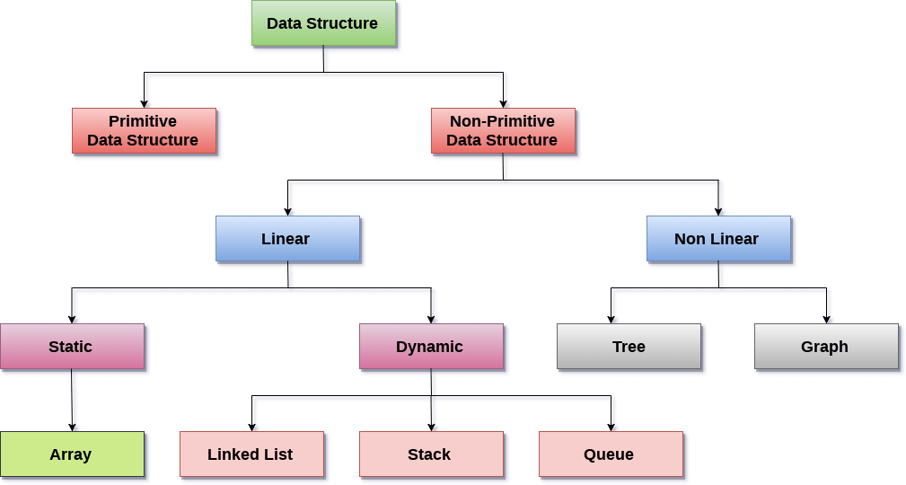

# Algorithms

## Contents

 - [Design and Analysis of Algorithms](#daa)
 - [Data Structures](#ds)

---

## Design and Analysis of Algorithms

 - [Counting Statements](modules/design-and-analysis-of-algorithms/counting-statements.md)
 - [Asymptotic Analysis](modules/design-and-analysis-of-algorithms/asymptotic-analysis.md)
 - [Asymptotic notations](modules/design-and-analysis-of-algorithms/asymptotic-notations.md)

---

## Data Structures

 - **Data Structures:**
   - **Primitive Data Structures:**
   - **Non-Primitive Data Structures:**
     - **[Linear:](modules/ds/linear/linear-ds.md)**
       - **Static:**
         - Array:
       - **Dynamic:**
         - Linked-List:
         - Stack:
         - Queue:
     - **[Non-Linear:](modules/ds/non-linear/non-linear-ds.md)**
       - Tree:
       - Graph:

---

Ro**drigo** **L**eite da **S**ilva - **drigols**
