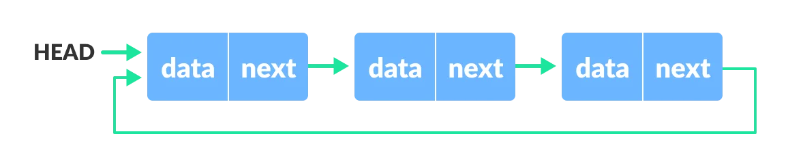

# Linked List

## Contents

 - **Theory:**
   - [Intro to Linked List](#intro-to-ll)
   - ["Node" representation in the Linked List](#node-representation)
 - **Singly Linked List:**
   - [Intro to Singly Linked List](#intro-to-sll)
 - **Doubly Linked List:**
   - [Intro to Doubly Linked List](#intro-to-dll)
 - **Circular Linked List:**
   - [Intro to Circular Linked List](#intro-to-cll)
 - **Tips & Tricks:**
   - [Linked List Applications](#ll-applications)
   - [Advantages & Disadvantages](#adv-disa)
   - [Linked List vs. Array](#ll-vs-array)


---

<div id="intro-to-ll"></div>

## Intro to Linked List

> A **Linked List** is a *linear data structure* that includes a series of connected **nodes**.

Here, each **node**:

 - Stores the **data**;
 - And the **address** of the next node.

For example,

  

 - You have to start somewhere, so we give the address of the first node a special name called **HEAD**.
 - Also, the last node in the linked list can be identified because its next portion points to **NULL**.

---

<div id="node-representation"></div>

## "Node" representation in the Linked List

Let's see how each **node** of the **linked list** is represented. Each **node** consists:

 - A data item;
 - An address of another node.

We wrap both the data item and the next node reference in a struct as:

**C++ representation:**  
```cpp
// Creating a node
class Node {
public:
    int data;
    Node* next;
};
```

**Python representation:**  
```python
class Node:

    def __init__(self, data):
        self.data = data  # Assign data.
        self.next = None  # Initialize.
```

---

<div id="intro-to-sll"></div>

## Intro to Singly Linked List

**Singly Linked List** is the most common. Each **node** has *data* and a *pointer* to the next **node**:


For example, see the **Singly Linked List** code below:

**C++:**  
[singly_linked_list.cpp](src/singly_linked_list.cpp)
```cpp
#include <iostream>
using namespace std;

// Node class representation.
class Node
{
public:
    int data;
    Node *next;
};

void printList(Node* n); // Function prototype.

// Driver's code.
int main()
{
    Node *head = NULL;
    Node *second = NULL;
    Node *third = NULL;

    // allocate 3 nodes in the heap.
    head = new Node();
    second = new Node();
    third = new Node();

    head->data = 1;       // assign data in first node.
    head->next = second;  // Link first node with second.

    second->data = 2;     // assign data to second node.
    second->next = third; // Link second node with third.

    third->data = 3;      // assign data to third node.
    third->next = NULL;   // Pointer next to NULL.

    // Function call
    printList(head);

    return 0;
}

// This function prints contents of linked list
void printList(Node* node_n)
{
    while (node_n != NULL)
    {
        cout << node_n->data << " ";
        node_n = node_n->next;
    }
}
```

**Python:**  
[singly_linked_list.py](src/singly_linked_list.py)
```python
class Node:

	# Function (constructor) to initialise the node object.
	def __init__(self, data):
		self.data = data # Assign data.
		self.next = None # Initialize next as NULL (None in Python).


# Linked List class contains a Node object.
class LinkedList:

	# Function (constructor) to initialize the head.
	def __init__(self):
		self.head = None

	# This function prints contents of linked list
	# starting from head
	def printList(self):
		temp = self.head
		while (temp):
			print(temp.data)
			temp = temp.next


# Driver's code.
if __name__ == '__main__':

	# Start with the empty list
	llist = LinkedList()

	llist.head = Node(1) # assign data to first node.
	second = Node(2)     # assign data to second node.
	third = Node(3)      # assign data to third node.

	llist.head.next = second # Link first node with second.
	second.next = third      # Link second node with the third node.

	llist.printList() # Print Node's values.
```

---

<div id="intro-to-dll"></div>

## Intro to Doubly Linked List

> In a **Doubly Linked List** we add a pointer to the *previous* node. Thus, we can go in either direction: **forward** or **backward**.

  

For example, see the **Doubly Linked List** code below:

**C++:**  
[doubly_linked_list_node.cpp](src/doubly_linked_list_node.cpp)
```cpp
#include <iostream>
using namespace std;

// Node of a doubly linked list
class Node {
public:
    int data;
    Node *next; // Pointer to next node in DLL.
    Node *prev; // Pointer to previous node in DLL.
};
```

**Python:**  
[doubly_linked_list_node.py](src/doubly_linked_list_node.py)
```python
class Node:

  # Node constructor.
	def __init__(self, data=None, next=None, prev=None):
		self.data = data
		self.next = next # reference to next node in DLL.
		self.prev = prev # reference to previous node in DLL.
```

---

<div id="intro-to-cll"></div>

## Intro to Circular Linked List

> A **Circular Linked List** is a variation of a *Linked List* in which the last element is linked to the first element. **This forms a circular loop**.

  

A **Circular Linked List** can be either *Singly Linked* or *Doubly Linked*:

 - For *Singly Linked List*, next pointer of last item points to the first item.
 - In the *Doubly Linked List*, prev pointer of the first item points to the last item as well.

---

<div id="ll-applications"></div>

## Linked List Applications

 - **Applications of Linked Lists:**
   - Linked Lists are used to implement *stacks* and *queues*.
   - It is used for the various representations of *trees* and *graphs*.
   - It is used in *dynamic memory allocation* (linked list of free blocks).
   - It is used for representing *sparse matrices*.
   - It is used for the *manipulation of polynomials*.
   - It is also used for performing *arithmetic operations on long integers*.
   - It is used for *finding paths in networks*.
 - **Applications of Linked Lists in real world:**
   - The list of songs in the *music player are linked* to the *previous* and *next* songs.
   - In a *web browser*, *previous* and *next web page URLs* are *linked* through the previous and next buttons.
   - In *image viewer*, the *previous* and *next images* are *linked* with the help of the previous and next buttons.
   - In *mobile phones*, we save the contacts of the people. The newly entered contact details will be placed at the correct alphabetical order. This can be achieved by linked list to set contact at correct alphabetical position.
   - The *modifications that we make in documents* are actually created as *nodes* in *doubly linked list*. We can simply use the undo option by pressing Ctrl+Z to modify the contents. It is done by the functionality of linked list.

---

<div id="adv-disa"></div>

## Advantages & Disadvantages

 - **Advantages of Linked Lists:**
   - *Insertion* and *deletion* in linked lists are *very efficient*.
   - Linked list can be *expanded in constant time*.
   - For implementation of *stacks* and *queues* and for representation of *trees* and *graphs*.
   - Linked lists *are used for dynamic memory allocation* which means *effective memory* utilization hence, no memory wastage.
 - **Disadvantages of Linked Lists:**
   - Use of pointers is more in linked lists hence, complex and requires more memory.
   - Searching an element is costly and requires *O(n)* time complexity.
   - Traversing is more time consuming and reverse traversing is not possible in singly linked lists.
   - Random access is not possible due to dynamic memory allocation.

---

<div id="ll-vs-array"></div>

## Linked List vs. Array

 - **Array:**
   - **Arrays store elements in contiguous memory locations**, resulting in easily calculable addresses for the elements stored and this allows faster access to an element at a specific index.
 - **Linked List:**
   - Linked lists are less rigid in their storage structure and elements are **usually not stored in contiguous locations**, hence they need to be stored with additional tags giving a reference to the next element. 

**NOTE:**  
This difference in the data storage scheme decides which data structure would be more suitable for a given situation. 

  
  
  

---

**REFERENCES:**  
[Types of Linked List - Singly linked, doubly linked and circular](https://www.programiz.com/dsa/linked-list-types)  
[Linked list Data Structure](https://www.programiz.com/dsa/linked-list)  
[What is Linked List](https://www.geeksforgeeks.org/what-is-linked-list//)  
[Applications, Advantages and Disadvantages of Linked List](https://www.geeksforgeeks.org/applications-advantages-and-disadvantages-of-linked-list/)  
[Linked List vs Array](https://www.geeksforgeeks.org/linked-list-vs-array/)  

---

Ro**drigo** **L**eite da **S**ilva - **drigols**
