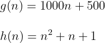
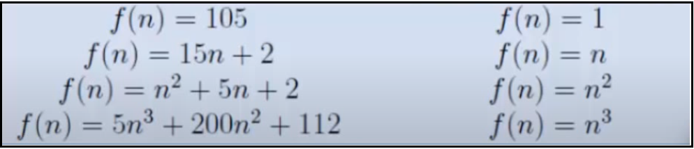

# Asymptotic Analysis

## Contents

 - [Intro to Asymptotic Analysis](#intro-to-aa)
 - [Asymptotic Analysis example with search problem](#aa-sp)
 - [Understanding Asymptotic Behavior](#aab)

---

## Intro to Asymptotic Analysis

> **Given two algorithms for a task, how do we find out which one is better?**

One naive way of doing this is – to implement both the algorithms and run the two programs on your computer for different inputs and see which one takes less time. There are many problems with this approach for the analysis of algorithms.

For example:

 - It might be possible that for **some inputs**, **the first algorithm performs better than the second**:
   - And for **some inputs second performs better**.
 - It might also be possible that for **some inputs**, **the first algorithm performs better on one *machine***:
   - And **the second works better on another *machine*** for *some other inputs*.

Asymptotic Analysis is the big idea that handles the above issues in analyzing algorithms:

 - **[ENG] -** In Asymptotic Analysis, we **evaluate the performance of an algorithm in terms of input size** (we don’t measure the actual running time). We calculate, how the time (or space) taken by an algorithm increases with the input size.
 - **[PT-BR] -** Na Análise Assintótica, **avaliamos o desempenho de um algoritmo em termos de tamanho de entrada** (não medimos o tempo real de execução). Calculamos como o tempo (ou espaço) gasto por um algoritmo aumenta com o tamanho da entrada. 

---

## Asymptotic Analysis example with search problem

Let us consider the **search problem (searching a given item)** in a sorted array:

  

The solution to above search problem includes:

 - **Linear Search** (order of growth is linear).
 - **Binary Search** (order of growth is logarithmic).

To understand how **Asymptotic Analysis** solves the problems mentioned above in analyzing algorithms, let us say:

 - We run the **Linear Search** on a **fast computer A**.
 - And **Binary Search** on a **slow computer B**.
 - Pick the *constant values* for the two computers so that it tells us exactly how long it takes for the given machine to perform the search in seconds.

Now, let’s say the constant for **computer A** is **0.2** and the constant for **computer B** is **1000**.

> **NOTE:**  
> Which means that **computer A** is **5000** times more powerful than **computer B**.

 - For **small values** of **input array size n**, the *fast computer (computer A)* may take less time.
 - But, **after a certain value of input array size, the Binary Search will definitely start taking less time compared to the Linear Search even though the Binary Search is being run on a slow machine**.

For example, see the table below comparing the search algorithms:

| Input Size    | Running time on computer A | Running time on computer B |
|---------------|----------------------------|----------------------------|
| 10	          | 2 sec                      | ~ 1 h                      |
| 100	          | 20 sec                     | ~ 1.8 h                    |
| 106 | ~ 55.5 h                   | ~ 5.5 h                    |
| 109	| ~ 6.3 years                | ~ 8.3 h                    |

See that from **n (input size) >= 106** the algorithm A (Linear Search) will always take more time compared algorithm B (Binary Search).

 - The reason is the **order of growth of Binary Search** with respect to input size is **logarithmic**.
 - While the **order of growth of Linear Search** is **linear**.

> **NOTE:**  
> So the machine-dependent **constants can always be ignored** after a certain value of input size.

Running times for this example:

 - **Linear Search:**
   - Running time in seconds on computer A: **0.2 * n**.
 - **Binary Search:**
   - Running time in seconds on computer B: **1000*log(n)**

**Does Asymptotic Analysis always work?**  
Asymptotic Analysis is not perfect, but that’s the best way available for analyzing algorithms.

**NOTE:**  
For example, say there are two sorting algorithms that take **1000nLogn** and **2nLogn** time respectively on a machine. Both of these algorithms are asymptotically the same **(order of growth is nLogn)**. So, With Asymptotic Analysis, we can’t judge which one is better as we ignore constants in Asymptotic Analysis.

**NOTE:**  
Also, in Asymptotic analysis, we always talk about input sizes larger than a constant value. It might be possible that those large inputs are never given to your software and an asymptotically slower algorithm always performs better for your particular situation. So, you may end up choosing an algorithm that is Asymptotically slower but faster for your software.

---

## Understanding Asymptotic Behavior

Knowing that discarding all constant terms and maintaining only the highest growth, we obtain the **Asymptotic behavior**.

> **Asymptotic behavior is the behavior of a function *T(n)* when *"n"* tends to infinity.**

This happens (acontece) because the term that has the largest exponent dominates the behavior of the function **T(n)** when **"n"** tends to infinity.

To understand better, consider the following functions (algorithms):

Although (embora/apesar) the function **g(n)** has higher constants multiplying *(1000 and 500)* your terms, exist a value to **"n"** where the function (algorithms) **h(n)** will always greater than the **g(n)** function.

For example, let's test some **"n"** values to the functions **g(n)** and **h(n)**:

 - **n = 10**
   - g(n): 10.500
   - h(n): 111
 - **n = 100**
   - g(n): 100.500
   - h(n): 10.101
 - **n = 1.000**
   - g(n): 1.000.500
   - h(n): 1.001.001
 - **n = 1.500**
   - g(n): 1.500.500
   - h(n): 2.251.501
 - **n = 2.000**
   - g(n): 2.000.500
   - h(n): 4.002.001
 - **n = 2.500**
   - g(n): 2.500.500
   - h(n): 6.252.501
 - **n = 3.000**
   - g(n): 3.000.500
   - h(n): 9.003.001
 - **n = 3.500**
   - g(n): 3.500.500
   - h(n): 12.253.501
 - **n = 4.000**
   - g(n): 4.000.500
   - h(n): 16.004.001
 - **n = 4.500**
   - g(n): 4.500.500
   - h(n): 20.254.501
 - **n = 5.000**
   - g(n): 5.000.500
   - h(n): 25.005.001
 - **n = 5.500**
   - g(n): 5.500.500
   - h(n): 30.255.501
 - **n = 6.000**
   - g(n): 6.000.500
   - h(n): 36.006.001
 - **n = 6.500**
   - g(n): 6.500.500
   - h(n): 42.256.501
 - **n = 7.000**
   - g(n): 7.000.500
   - h(n): 49.007.001
 - **n = 7.500**
   - g(n): 7.500.500
   - h(n): 56.257.501
 - **n = 8.000**
   - g(n): 8.000.500
   - h(n): 64.008.001
 - **n = 8.500**
   - g(n): 8.500.500
   - h(n): 72.258.501
 - **n = 9.000**
   - g(n): 9.000.500
   - h(n): 81.009.001
 - **n = 9.500**
   - g(n): 9.500.500
   - h(n): 90.259.501
 - **n = 10.000**
   - g(n): 10.000.500
   - h(n): 100.010.001

See that for **n => 1500** the function (algorithm) **h(n)** will always be greater than the function (algorithm) **g(n)**.

> **NOTE:**
> - That is, the asymptotic behavior focuses on the largest term of a function (algorithm) because this term will describe the behavior of the function (algorithm).
> - We say that the function **h(n)** is **n2**.

See another functions and your **asymptotic behavior**:

  

**NOTE:**  
Note that the focus is always the largest term of the function.

---

**REFERENCES:**  
[[ED] Aula 101 - Análise de Algoritmos - Comportamento Assintótico](https://www.youtube.com/watch?v=SClFMUpBiaw&list=PL8iN9FQ7_jt6buW7SBD3yzjIp8NnJYrZl&index=3)

---

Ro**drigo** **L**eite da **S**ilva - **drigols**
