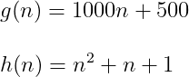
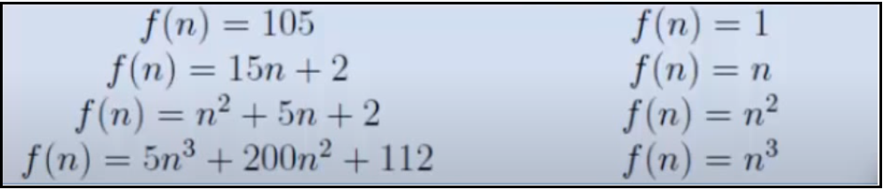

# Asymptotic Behavior

## Contents

 - [Understanding asymptotic behavior (Algorithm Analysis)](#asymptotic-behavior)

---

## Asymptotic behavior (Algorithm Analysis)

Discarding all constant terms and maintaining only the highest growth, we obtain the **Asymptotic behavior**.

> **Asymptotic behavior is the behavior of a function *T(n)* when *"n"* tends to infinity.**

This happens (acontece) because the term that has the largest exponent dominates the behavior of the function **T(n)** when **"n"** tends to infinity.

To understand better, consider the following functions (algorithms):

Although (embora/apesar) the function **g(n)** has higher constants multiplying *(1000 and 500)* your terms, exist a value to **"n"** where the function (algorithms) **h(n)** will always greater than the **g(n)** function.

For example, let's test some **"n"** values to the functions **g(n)** and **h(n)**:

 - **n = 10**
   - g(n): 10.500
   - h(n): 111
 - **n = 100**
   - g(n): 100.500
   - h(n): 10.101
 - **n = 1.000**
   - g(n): 1.000.500
   - h(n): 1.001.001
 - **n = 1.500**
   - g(n): 1.500.500
   - h(n): 2.251.501
 - **n = 2.000**
   - g(n): 2.000.500
   - h(n): 4.002.001
 - **n = 2.500**
   - g(n): 2.500.500
   - h(n): 6.252.501
 - **n = 3.000**
   - g(n): 3.000.500
   - h(n): 9.003.001
 - **n = 3.500**
   - g(n): 3.500.500
   - h(n): 12.253.501
 - **n = 4.000**
   - g(n): 4.000.500
   - h(n): 16.004.001
 - **n = 4.500**
   - g(n): 4.500.500
   - h(n): 20.254.501
 - **n = 5.000**
   - g(n): 5.000.500
   - h(n): 25.005.001
 - **n = 5.500**
   - g(n): 5.500.500
   - h(n): 30.255.501
 - **n = 6.000**
   - g(n): 6.000.500
   - h(n): 36.006.001
 - **n = 6.500**
   - g(n): 6.500.500
   - h(n): 42.256.501
 - **n = 7.000**
   - g(n): 7.000.500
   - h(n): 49.007.001
 - **n = 7.500**
   - g(n): 7.500.500
   - h(n): 56.257.501
 - **n = 8.000**
   - g(n): 8.000.500
   - h(n): 64.008.001
 - **n = 8.500**
   - g(n): 8.500.500
   - h(n): 72.258.501
 - **n = 9.000**
   - g(n): 9.000.500
   - h(n): 81.009.001
 - **n = 9.500**
   - g(n): 9.500.500
   - h(n): 90.259.501
 - **n = 10.000**
   - g(n): 10.000.500
   - h(n): 100.010.001

See that for **n => 1500** the function (algorithm) **h(n)** will always be greater than the function (algorithm) **g(n)**.

> **NOTE:**
> - That is, the asymptotic behavior focuses on the largest term of a function (algorithm) because this term will describe the behavior of the function (algorithm).
> - We say that the function **h(n)** is **n2**.

See another functions and your **asymptotic behavior**:

  

**NOTE:**  
Note that the focus is always the largest term of the function.

---

**REFERENCES:**  
[[ED] Aula 101 - Análise de Algoritmos - Comportamento Assintótico](https://www.youtube.com/watch?v=SClFMUpBiaw&list=PL8iN9FQ7_jt6buW7SBD3yzjIp8NnJYrZl&index=3)

---

Ro**drigo** **L**eite da **S**ilva - **drigols**
