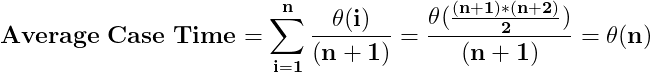

# Asymptotic notations

## Contents

 - [Big Oh (O) Notation ( Worst-Case / Upper Bound )](#big-o-notation)
 - [Omega (Ω) Notation ( Best Case / Lower Bound)](#omega-notation)
 - [Theta (Θ) Notation ( Average Case / Average Bound )](#theta-notation)
 - **Cases (examples):**
   - [Linear search algorithm](#case-lsa)
 - **Tips & Tricks:**
   - [Algorithms with same Asymptotic Notation for all the cases (worst, best, average)](#algo-same-an)

---

<div id="big-o-notation"></div>

## Big Oh (O) Notation ( Worst-Case / Upper Bound )

> We define an algorithm’s **worst-case** time complexity by using the **Big-O (O) notation**, which determines the set of functions grows slower than or at the same rate as the expression. Furthermore, **it explains the maximum amount of time an algorithm requires to consider all input values**.

**Worst Case Analysis (Mostly used):**

 - In the **worst-case analysis**, **we calculate the upper bound on the running time of an algorithm**.
 - We must know (devemos conhecer) **the case that causes a maximum number of operations to be executed**.
 - For example, *Linear Search*, the **worst case happens when the element to be searched (x) is not present in the array**:
   - When x is not present, the search() function compares it with all the elements of arr[] one by one.
   - Therefore, the worst-case time complexity of the linear search would be **O(n)**.

---

<div id="omega-notation"></div>

## Omega (Ω) Notation ( Best Case / Lower Bound)

> It defines the **best case** of an algorithm’s time complexity, the **Omega (Ω) notation** defines whether the set of functions will grow faster or at the same rate as the expression. Furthermore, **it explains the minimum amount of time an algorithm requires to consider all input values**.

**Best Case Analysis (Very Rarely used)**

 - In the **best-case analysis**, **we calculate the lower bound on the running time of an algorithm**.
 - We must know (devemos conhecer) **the case that causes a minimum number of operations to be executed**.
 - For example, in the linear search problem, the best case occurs when x is present at the first location:
   - The number of operations in the best case is constant (not dependent on n).
   - So time complexity in the best case would be **Ω(1)**.

---

<div id="theta-notation"></div>

## Theta (Θ) Notation ( Average Case / Average Bound )

> It defines the **average case** of an algorithm’s time complexity, the **Theta (Θ) notation** defines **when the set of functions lies in both O(expression) and Omega(expression), then Theta (Θ) notation is used**. This is how we **define a time complexity average case for an algorithm**.

**Average Case Analysis (Rarely used):**

 - In **average case analysis**, **we take all possible inputs and calculate the computing time for all of the inputs**.
 - **Sum all the calculated values** and **divide the sum by the total number of inputs**.
 - We must know (devemos conhece or predict) the distribution of cases.
 - For example, in the linear search problem, let us assume that all cases are [uniformly distributed](https://en.wikipedia.org/wiki/Discrete_uniform_distribution) (including the case of x not being present in the array).
 - So we sum all the cases and divide the sum by (n+1).
 - Following is the value of average-case time complexity.



---

<div id="case-lsa"></div>

## Linear search algorithm

Imagine you have the follow **Linear Search Algorithms**:

[linear_search.cpp](src/linear_search.cpp)
```cpp
#include <iostream>
using namespace std;

// Linearly search x in arr[].
// If x is present then return the index,
// otherwise return -1
int search(int arr[], int n, int x)
{
	int i;
	for (i = 0; i < n; i++) {
		if (arr[i] == x)
			return i;
	}
	return -1;
}


// Driver's Code
int main()
{
	int arr[] = { 1, 10, 30, 15 };
	int x = 30;
	int n = sizeof(arr) / sizeof(arr[0]);

	// Function call
	cout << x << " is present at index "
		<< search(arr, n, x);

	return 0;
}
```

**OUTPUT:**  
```cpp
30 is present at index 2
```

[linear_search.py](src/linear_search.py)
```python
# Linearly search x in arr[].
# If x is present then return the index,
# otherwise return -1
def search(arr, x):
    for index, value in enumerate(arr):
        if value == x:
            return index
    return -1


# Driver's Code
if __name__ == '__main__':
    arr = [1, 10, 30, 15]
    x = 30

    # Function call
    print(x, "is present at index", search(arr, x))
```

**OUTPUT:**  
```python
30 is present at index 2
```

The **time complexity analysis** to the algorithm above is **(In Big-O notation)**:

 - **Best Case: O(1)**
   - This will take place if the element to be searched is on the first index of the given list. So, the number of comparisons, in this case, is 1.
 - **Average Case: O(n)**
   - This will take place if the element to be searched is on the middle index of the given list.
 - **Worst Case: O(n)**
   - The element to be searched is on the last index.
   - Or the element to be searched is not present on the list

---

<div id="algo-same-an"></div>

## Algorithms with same Asymptotic Notation for all the cases (worst, best, average)

For some algorithms, all the *cases (worst, best, average)* are asymptotically the same. i.e., there **are no worst** and **best cases**.

**NOTE:**  
For example, [Merge Sort](https://en.wikipedia.org/wiki/Merge_sort) does **Θ(n log(n))** operations in all cases.

---

[Worst, Average and Best Case Analysis of Algorithms](https://www.geeksforgeeks.org/worst-average-and-best-case-analysis-of-algorithms/)  
[Time Complexity Analysis](https://log2base2.com/courses/time-complexity-analysis)

---

Ro**drigo** **L**eite da **S**ilva - **drigols**
